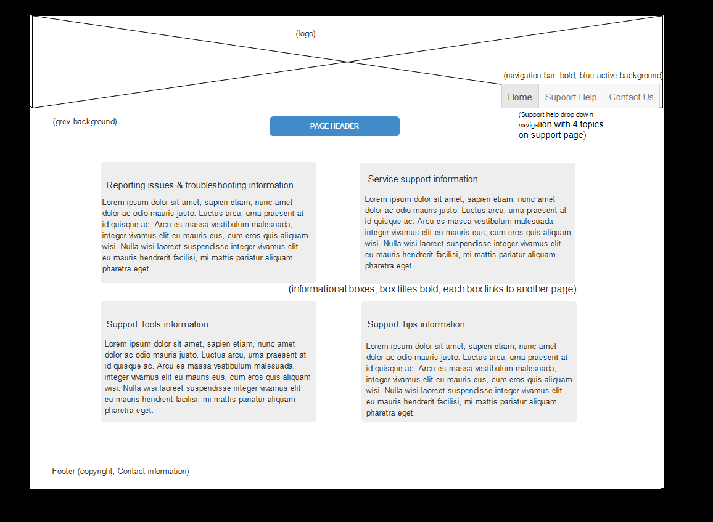

# My INF 7420 Project

## Wireframes

To proficiently build my fictional Library IT Support company website, I have developed multiple wireframes. These multiple wireframes were created in order to help shape the content of the company and develop a consistent structure to display the content across all of the website pages.

The proposed layouts are chic and sophisticated to engage the user and have an optimal easy navigation around the company’s website.
## Home Page
The Home page is the main page of the company’s website. This page will provide the user an overview of the company and services offered.

At the top of the page will be the company’s logo.

Header - will be mission statement of the company

Navigation Menu - will include links to other pages (Home, Support, and Contact) and will also be positioned as a bar on the right side. There will also be a drop down navigation bar under “Support” to the sub information of the Support page

Main Content- will provide overview of the company and services provided

Footer - will include contact information, social media links, and copyright information
## Support Page
This page will provide a quick support topics for the user to choose to narrow down support information for the user.

At the top of the page will be the company’s logo.

Header - will include title of page (Support)

Navigation Menu - will include links to other pages (Home, Support, and Contact) and will also be positioned as a bar on the right side. There will also be a drop down navigation bar under “Support” to the sub information of the Support page.

Main Content - will four support categories or support topics. Category titles will link to their own individual pages.

Footer - will include contact information, social media links, and copyright information
## Contact Page
This page will allow users to connect the company through a contact form.

At the top of the page will be the company’s logo.

Header - will include title of page (Contact Us)

Navigation Menu - will include links to other pages (Home, Support, and Contact) and will also be positioned as a bar on the right side. There will also be a drop down navigation bar under “Support” to the sub information of the Support page

Main Content – will have a contact form for user to fill out for questions or informational purposes.

Footer - will include contact information, social media links, and copyright information

## Support1-Support4 Pages
These pages will provide a support information for the user for the topic that the user selected.

At the top of the page will be the company’s logo.

Header - will include title of page (Support {topic})

Navigation Menu - will include links to other pages (Home, Support, and Contact) and will also be positioned as a bar on the right side. There will also be a drop down navigation bar under “Support” to the sub information of the Support page

Main Content - will be support information for the topic the user selected.

Footer - will include contact information, social media links, and copyright information
